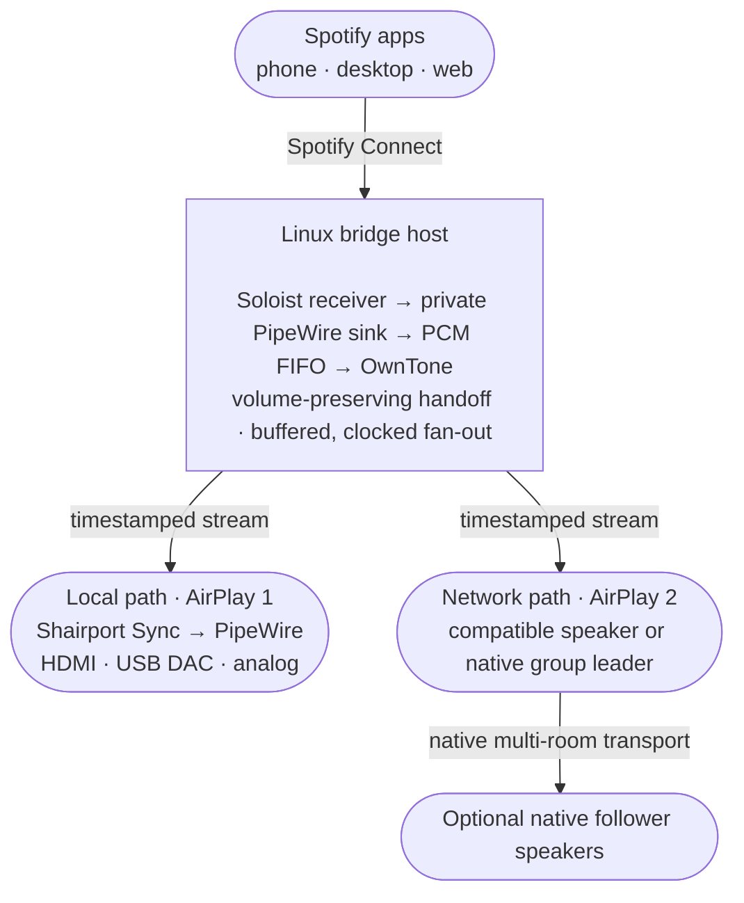

# Spotify Connect bridge for Linux and AirPlay audio

Turn a Linux machine into one Spotify Connect target that plays through local
audio hardware and networked AirPlay speakers at the same time. The reference
deployment synchronizes a PC's DisplayPort audio with an existing WiiM
multi-room group, but the underlying pipeline is useful anywhere local and
network audio outputs need to share one Spotify source and one timeline.

The bridge keeps Spotify isolated from the desktop's default audio route,
offers independent output levels and timing offsets, preserves volume during
Connect handoffs, and restores the working topology after a reboot.

## How it works



OwnTone timestamps both output paths. The local path loops back through
Shairport Sync to any PipeWire-supported audio device. The network path sends
one AirPlay 2 stream to a compatible speaker or group leader; in the reference
WiiM setup, that leader distributes the stream to its native followers. The
bridge never selects a WiiM follower independently or changes native group
membership.

All paths are buffered for synchronized music. This is designed for music, not
games or lip-synced video.

## Where this can be useful

- Add speakers connected to a Linux PC, mini PC, or home server to an existing
  AirPlay listening zone.
- Play Spotify through a legacy amplifier or powered monitors via a USB DAC
  while keeping network speakers synchronized.
- Feed a native multi-room group through its leader without dismantling or
  duplicating the vendor-managed group.
- Build a headless, auto-recovering Spotify-to-AirPlay gateway for a media rack,
  workshop, office, or whole-home audio system.
- Use the PipeWire-to-PCM-to-OwnTone pipeline as a starting point for other
  mixed local/network audio experiments.

Today, the supplied reconciliation and health-check tooling intentionally
targets one local AirPlay 1 receiver plus one AirPlay 2 WiiM leader with a
native follower. The media pipeline is more general; supporting standalone
AirPlay speakers, another multi-room vendor, or more output branches mainly
requires adapting the topology guard and output-selection policy.

## Reference deployment requirements

- Linux with PipeWire's PulseAudio compatibility service
- Docker Engine with Docker Compose v2
- Python 3.10 or newer
- Spotify Premium and a Spotify Soloist developer API key
- One WiiM leader with its native follower group already configured
- DHCP reservations for the WiiM addresses used in `.env`

The current images target x86-64 because the official Soloist archive in the
Dockerfile is the x86-64 build.

## Install

Clone the repository, then create the local configuration:

```bash
cp .env.example .env
chmod 600 .env
```

Edit `.env` for the current user, PipeWire sink, WiiM addresses and names. The
file is intentionally ignored by Git. Save the Soloist key without displaying
it in the terminal or shell history:

```bash
./save-soloist-key.sh
```

Prepare and start the bridge:

```bash
./ensure-runtime.sh
docker compose up -d --build --wait --wait-timeout 180
./bridge.py reconcile --wait-seconds 180
./doctor.py
```

Install the relocatable user service so the bridge starts after boot:

```bash
./install-service.sh
loginctl enable-linger "$USER"
```

`install-service.sh` renders a machine-local unit containing the clone's
absolute path. Keep the clone path free of whitespace; moving the repository
later requires running the installer again.

## Normal use

Select the configured bridge name (default: **PC + WiiM**) in Spotify and play
normally. The user service remembers the stable volume of the active Spotify
device while the bridge is inactive and reapplies it when playback moves to the
bridge. This keeps Spotify's volume slider from jumping when **PC + WiiM** is
selected. It reads the live level from Spotify's Linux desktop MPRIS interface;
if that client is unavailable, it reuses the last saved level (40% on a fresh
installation). Useful controls are:

```bash
./bridge.py status
./bridge.py group-status
./bridge.py reconcile
./bridge.py select-all --confirm-wiim-takeover
./bridge.py select-local
./bridge.py set-volume local 100
./bridge.py set-volume wiim 50
./bridge.py set-offset local 125
./bridge.py stop
./doctor.py
```

`reconcile` verifies the native WiiM topology before restoring the two selected
outputs, their volumes, and their sync offsets from `.env`. The boot service
waits up to three minutes for OwnTone and the WiiMs, then runs this command.

`select-all` also fails closed unless the configured leader and follower
topology is healthy. Its confirmation flag acknowledges that starting AirPlay
will replace whatever source is currently active on the WiiM leader.

`stop` deselects OwnTone outputs without changing native WiiM group membership.
Positive offsets delay that output; valid offsets are -2000 through 2000 ms.

## Configuration

`.env.example` documents every host-specific value. The most important are:

| Setting | Purpose |
| --- | --- |
| `DISPLAYPORT_SINK` | Stable PipeWire sink used by the local Shairport stream |
| `KITCHEN_IP`, `LIVING_ROOM_IP` | Reserved addresses used for fail-closed topology checks |
| `KITCHEN_DEVICE_NAME` | AirPlay service name advertised by the WiiM leader |
| `LOCAL_OUTPUT_NAME`, `WIIM_OUTPUT_NAME` | Exact OwnTone output identities |
| `LOCAL_VOLUME`, `WIIM_VOLUME` | Levels restored by reconciliation |
| `LOCAL_OFFSET_MS`, `WIIM_OFFSET_MS` | Per-output synchronization adjustments |

`ensure-runtime.sh` renders `runtime/owntone.conf` from `owntone.conf.in` on
every start. Runtime state and configuration are not committed.

The Soloist key is authoritative at the path configured by
`SOLOIST_KEY_FILE`. An ignored, mode-600 project backup is maintained at
`.secrets/soloist_api_key`. Neither file belongs in Git or the Docker build
context.

## Reliability model

- Image bases and third-party images are pinned by digest.
- Soloist is forced to a private `wiim_bridge` PipeWire sink.
- PCM capture uses 44.1 kHz signed 16-bit stereo and a tested 100 ms fragment.
- OwnTone uses a configurable 2250 ms startup buffer by default.
- The Soloist entrypoint supervises both Soloist and `parec`; either child
  exiting restarts the container.
- Shairport uses classic AirPlay to avoid competing with OwnTone for AirPlay 2
  PTP services. Its Pulse backend shares the selected PC sink with desktop audio.
- All containers use `unless-stopped`; systemd waits for PipeWire and Docker.
- Startup reconciliation restores output selection, volume and offsets rather
  than relying only on OwnTone's cache database.
- The host-side handoff monitor preserves Spotify's source volume when Soloist
  becomes active and stores only the numeric level for the next restart.
- `doctor.py` audits secrets, containers, startup, audio routing, output state,
  WiiM topology, and Soloist expiry without changing the system.

## Updates

Official Soloist development builds expire after roughly 90 days. Check the
official download without changing the installation:

```bash
./update-soloist.sh --check
```

Install a newer build when available:

```bash
./update-soloist.sh --apply
```

The updater calculates the archive SHA-256, updates the Dockerfile and local
image tag, rebuilds Soloist, and recreates only that container. Review and
commit those pin changes after `./doctor.py` passes.

Dependabot checks Docker and GitHub Actions dependencies monthly. CI validates
the Python tests, syntax, Compose model, shell scripts, and credential scan.

## Recovery on a replacement machine

1. Install the prerequisites and clone the private repository.
2. Restore `.env` from a secure backup or recreate it from `.env.example`.
3. Generate a fresh Soloist key and run `./save-soloist-key.sh`.
4. Run `./ensure-runtime.sh` and
   `docker compose up -d --build --wait --wait-timeout 180`.
5. Run `./install-service.sh`, enable user lingering, and reboot once.
6. Select the bridge in Spotify and run `./doctor.py`.

The ignored OwnTone and Soloist caches are optional. A clean machine can rebuild
them; the committed configuration and reconciliation command restore the
important behavior.

## Diagnostics and development

```bash
docker compose ps
docker compose logs --tail 150 owntone shairport soloist
systemctl --user status wiim-pc-bridge.service
journalctl --user -u wiim-pc-bridge.service
python3 -m unittest discover -s tests -v
docker compose --env-file .env.example config --quiet
./scripts/check-secrets.py
```

OwnTone's local web interface is available at <http://127.0.0.1:3689>.

See [SECURITY.md](SECURITY.md) before making a fork public.

## License

Released under the [MIT License](LICENSE).
