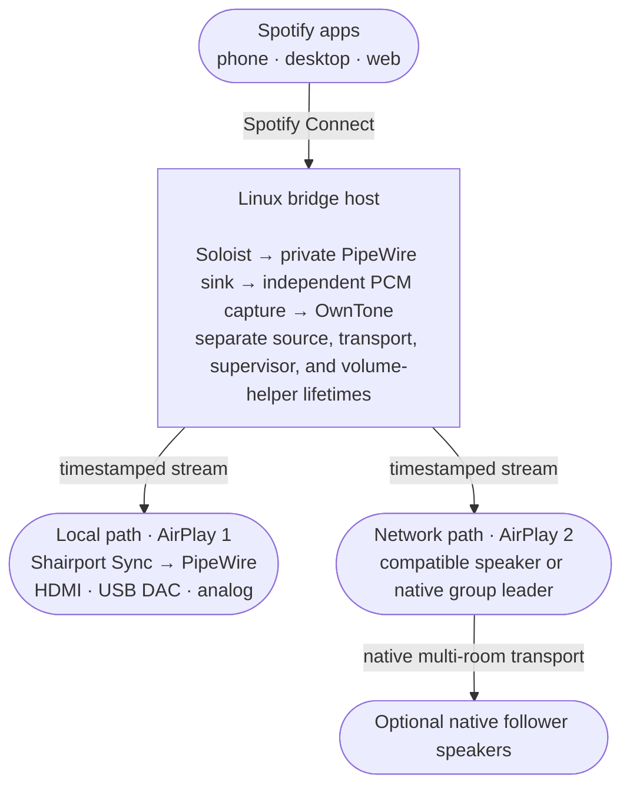

# Spotify Connect bridge for Linux and AirPlay audio

Turn a Linux machine into one Spotify Connect target that plays through local
audio hardware and networked AirPlay speakers at the same time. The reference
deployment synchronizes a PC's DisplayPort audio with an existing WiiM
multi-room group, but the underlying pipeline is useful anywhere local and
network audio outputs need to share one Spotify source and one timeline.

The bridge keeps Spotify isolated from the desktop's default audio route,
offers independent output levels and timing offsets, preserves volume during
Connect handoffs, and restores the working topology after a reboot.

## How it works


```mermaid
flowchart TB
    spotify(["Spotify apps<br/>phone · desktop · web"])
    pipeline["Linux bridge host<br/><br/>Soloist → private PipeWire sink → independent PCM capture → OwnTone<br/>separate source, transport, supervisor, and volume-helper lifetimes"]
    local(["Local path · AirPlay 1<br/>Shairport Sync → PipeWire<br/>HDMI · USB DAC · analog"])
    leader(["Network path · AirPlay 2<br/>compatible speaker or native group leader"])
    followers(["Optional native follower speakers"])

    spotify -->|"Spotify Connect"| pipeline
    pipeline -->|"timestamped stream"| local
    pipeline -->|"timestamped stream"| leader
    leader -->|"native multi-room transport"| followers
```

OwnTone timestamps both output paths. The local path loops back through
Shairport Sync to any PipeWire-supported audio device. The network path sends
one AirPlay 2 stream to a compatible speaker or group leader; in the reference
WiiM setup, that leader distributes the stream to its native followers. The
bridge never selects a WiiM follower independently or changes native group
membership.

All paths are buffered for synchronized music. This is designed for music, not
games or lip-synced video.

## Where this can be useful

- Add speakers connected to a Linux PC, mini PC, or home server to an existing
  AirPlay listening zone.
- Play Spotify through a legacy amplifier or powered monitors via a USB DAC
  while keeping network speakers synchronized.
- Feed a native multi-room group through its leader without dismantling or
  duplicating the vendor-managed group.
- Build a headless, auto-recovering Spotify-to-AirPlay gateway for a media rack,
  workshop, office, or whole-home audio system.
- Use the PipeWire-to-PCM-to-OwnTone pipeline as a starting point for other
  mixed local/network audio experiments.

Today, the supplied reconciliation and health-check tooling intentionally
targets one local AirPlay 1 receiver plus one AirPlay 2 WiiM leader with a
native follower. The media pipeline is more general; supporting standalone
AirPlay speakers, another multi-room vendor, or more output branches mainly
requires adapting the topology guard and output-selection policy.

## Reference deployment requirements

- Linux with PipeWire's PulseAudio compatibility service
- Docker Engine with Docker Compose v2
- Python 3.10 or newer
- Spotify Premium and a Spotify Soloist developer API key
- One WiiM leader with its native follower group already configured
- DHCP reservations for the WiiM addresses used in `.env`

The current images target x86-64 because the official Soloist archive in the
Dockerfile is the x86-64 build.

## Install

Clone the repository, then create the local configuration:

```bash
cp .env.example .env
chmod 600 .env
```

Edit `.env` for the current user, PipeWire sink, WiiM addresses and names. The
file is intentionally ignored by Git. Save the Soloist key without displaying
it in the terminal or shell history:

```bash
./save-soloist-key.sh
```

Prepare and start the bridge:

```bash
./ensure-runtime.sh
docker compose stop --timeout 20
docker compose up -d --build --wait --wait-timeout 180
./bridge.py reconcile --wait-seconds 180
./doctor.py
```

Install the relocatable user service so the bridge starts after boot:

```bash
./install-service.sh
loginctl enable-linger "$USER"
```

`install-service.sh` renders a machine-local unit containing the clone's
absolute path. Keep the clone path free of whitespace; moving the repository
later requires running the installer again.

## Normal use

Select the configured bridge name (default: **PC + WiiM**) in Spotify and play
normally. The user service remembers the stable volume of the active Spotify
device while the bridge is inactive and reapplies it when playback moves to the
bridge. This keeps Spotify's volume slider from jumping when **PC + WiiM** is
selected. It reads the live level from Spotify's Linux desktop MPRIS interface;
if that client is unavailable, it reuses the last saved level (40% on a fresh
installation). Useful controls are:

```bash
./bridge.py status
./bridge.py group-status
./bridge.py reconcile
./bridge.py select-all --confirm-wiim-takeover
./bridge.py select-local
./bridge.py set-volume local 100
./bridge.py set-volume wiim 50
./bridge.py set-offset local 125
./bridge.py stop
./doctor.py
```

`reconcile` verifies the native WiiM topology before restoring the two selected
outputs, their volumes, and their sync offsets from `.env`. The boot service
starts the containers; the independent supervisor then reconciles observed
playback with the desired output mode.

`select-all` also fails closed unless the configured leader and follower
topology is healthy. Its confirmation flag acknowledges that starting AirPlay
will replace whatever source is currently active on the WiiM leader.

`stop` deselects OwnTone outputs without changing native WiiM group membership.
Both `stop` and `select-local` suspend automatic reconnection using an explicit
persistent policy, so a network failure is no longer mistaken for a user command.
Use these commands for manual selection; direct OwnTone UI changes to the
configured pair cannot reliably be distinguished from a failed connection.
`select-all` or `reconcile` re-enables automatic recovery. The marker survives
service restarts and host reboots. CLI and supervisor output changes are
serialized to avoid competing selections.
Positive offsets delay that output; valid offsets are -2000 through 2000 ms.

## Configuration

`.env.example` documents every host-specific value. The most important are:

| Setting | Purpose |
| --- | --- |
| `DISPLAYPORT_SINK` | Stable PipeWire sink used by the local Shairport stream |
| `SHAIRPORT_INTERFACE` | Linux interface that reaches the speaker LAN; excludes Docker/VPN advertisements |
| `KITCHEN_IP`, `LIVING_ROOM_IP` | Reserved addresses used for fail-closed topology checks |
| `KITCHEN_DEVICE_NAME` | AirPlay service name advertised by the WiiM leader |
| `WIIM_FOLLOWERS` | Optional `ADDRESS=Name` list for groups with more than one follower |
| `TRUSTED_NETWORK` | Private `/8`, `/16` or `/24` allowed to control OwnTone |
| `LOCAL_OUTPUT_NAME`, `WIIM_OUTPUT_NAME` | Exact OwnTone output identities |
| `LOCAL_VOLUME`, `WIIM_VOLUME` | Levels restored by reconciliation |
| `LOCAL_OFFSET_MS`, `WIIM_OFFSET_MS` | Per-output synchronization adjustments |

`ensure-runtime.sh` renders `runtime/owntone.conf` from `owntone.conf.in` on
every start, writing through the existing file so a running OwnTone container
picks the change up on its next restart. Runtime state is not committed.

`TRUSTED_NETWORK` is the LAN permitted to control OwnTone without
authentication. OwnTone matches it on whole dotted octets rather than on CIDR,
so the value must be a private `/8`, `/16` or `/24` with no host bits set; both
WiiM addresses must fall inside it. Keep it no broader than necessary.

By default the group is one leader and one follower, taken from the
`KITCHEN_*` and `LIVING_ROOM_*` settings. Set `WIIM_FOLLOWERS` to run any other
number:

```bash
WIIM_FOLLOWERS=192.0.2.11=Follower One,192.0.2.12=Follower Two
```

Reconciliation compares the leader's reported followers against exactly this
set and refuses to select the WiiM output on any mismatch, naming what is
missing and what is unexpected.

The Soloist key and Pulse authentication cookie live only at the paths
configured by `SOLOIST_KEY_FILE` and `PULSE_COOKIE_PATH`. Both must be outside
the clone; configuration validation rejects paths inside it so neither
credential can be committed by a stray `git add -A`.

## Reliability model

- Image bases and third-party images are pinned by digest.
- Soloist is routed to a private `wiim_bridge` PipeWire sink, and the
  entrypoint refuses to capture from a pre-existing sink of that name whose
  format does not match.
- PCM capture uses 44.1 kHz signed 16-bit stereo and a tested 100 ms fragment.
- A small relay drains the capture client continuously and discards PCM when
  OwnTone pauses or closes its FIFO. It does not queue minutes of stale game or
  Spotify audio, or let a blocked writer grow PulseAudio's buffers until abort.
- OwnTone uses a configurable 2250 ms startup buffer by default.
- Soloist and PCM capture run in **separate containers**. Losing the FIFO reader
  or restarting OwnTone can restart capture without killing Spotify Connect.
- Shairport uses classic AirPlay to avoid competing with OwnTone for AirPlay 2
  PTP services. Its Pulse backend shares the selected PC sink with desktop audio,
  and its receiver advertisement is limited to the configured speaker-LAN
  interface so OwnTone cannot attach through transient Docker or VPN addresses.
- Three independent user units own stack lifecycle, playback supervision, and
  volume handoffs. A failed volume trace cannot stop playback supervision.
  Restarting either helper does not stop any audio container.
  Failed boot prerequisites retry every 30 seconds without cold-stopping the
  containers that are already running.
- The supervisor checks container/socket health, desired output mode, OwnTone's
  player state, the WiiM group/transport, the actual Soloist sink, and live PC
  PCM. It reports `idle`,
  `manual`, `connecting`, `playing`, `unverified`, `recovering`, or `degraded`.
  Silence is **unverified**, not proof of successful playback or a reason to
  restart. PC PCM plus a WiiM transport response cannot prove analog speaker
  audibility; listening remains part of acceptance testing.
- Recovery is scoped: reconnect outputs/resume the pipe, restart a failed
  receiver, then recover OwnTone/capture if necessary. There is no automatic
  full-stack restart. Two observations are required for destructive recovery,
  with buffering grace and at most three repairs per ten minutes. The budget
  survives supervisor restarts. An unavailable host audio server causes a wait.
- If PipeWire moves the identified Soloist stream to the desktop sink, the
  supervisor moves only that stream back to the private bridge sink. It checks
  this even while Spotify is paused, requires two observations, and limits
  route moves separately to three per ten minutes. It does not restart Spotify
  or change either output volume. An absent private sink or ambiguous stream
  identity is reported, not guessed at.
- The supervisor checks the *actual* source of the tagged PCM capture stream,
  not just its requested `target.object`. If a game/display transition moves it
  to the PC speaker monitor, it moves that one stream back to the private bridge
  monitor before allowing playback reconciliation; `doctor.py` also fails on
  this mismatch. It likewise restores an unambiguously identified Shairport
  stream to the configured PC sink after a device transition. These checks run
  while Spotify is idle, so they can repair the topology before playback resumes.
  They never change the system default sink or another application's stream.
- The supervisor identifies the separate Flatpak Spotify desktop stream through
  its PipeWire client identity. While the bridge is active it temporarily mutes
  that stream, restoring only a mute it applied itself when the conflict ends.
  The mute claim survives a recreated desktop stream, since PipeWire can carry
  the previous mute into a new stream ID.
  It also releases its owned mute if Soloist stops during a source-route fault;
  a routing fault must not strand direct PC playback. The health audit warns
  when the desktop app remains muted while bridge playback is idle.
  If the PC sink disappears and PipeWire moves the desktop stream onto the
  private capture sink, it moves the exact stream back when the PC sink returns;
  until then the stream stays muted to prevent it feeding the bridge. Other
  desktop applications are not muted or moved.
- A muted or still-corked local Shairport receiver is reported as degraded
  during active playback, never counted as verified PC playback based on
  another application's audio. The supervisor
  leaves a receiver mute in place because it may be an intentional safety stop;
  it does not trigger a container restart loop to try to clear it.
- If the configured physical PC sink is missing, active playback waits instead
  of connecting the local AirPlay path to a fallback or restarting Shairport.
  A powered-off DisplayPort monitor can cause this condition; restoring the
  device is a host-side prerequisite, not a bridge-container repair.
- Spotify is restarted only for a source-container fault or stale source audio
  socket mounts. A host audio-server reset can still lose the Spotify session;
  this is recorded as a source interruption, never described as seamless recovery.
- Idle playback disconnects the pair after 60 seconds and never injects a tone
  by default. After five seconds without an active Soloist source, it first
  pauses OwnTone's managed PCM pipe so the local AirPlay receiver cannot keep
  playing a stale buffer during the disconnect grace period. Active playback
  reconnects and resumes the pipe only after topology/source guards;
  another reported WiiM source is not automatically replaced.
- Desired `auto`, `local`, and `stopped` modes are stored atomically in the
  ignored cache. Manual intent survives restart/reboot, independent of OwnTone's
  transient connection flags. Reconnects restore configured levels/offsets.
- Read-only `doctor.py` checks the supervisor heartbeat and actual reported
  state, not just container liveness. Private status and bounded event history
  live in `runtime/supervisor-status.json` and `runtime/supervisor-events.log`.

### Distinguishing PC-only audio faults

The Spotify desktop app and the `PC + WiiM` Spotify Connect device are separate
players. The desktop app normally plays directly to the PC, but PipeWire may
move it to the private bridge sink when the physical PC sink disappears. That
can feed unintended audio into the bridge. `soloist ctl now` can report
`status=playing` while `is_active=false`.
Check both fields and the actual sink-input route before restarting anything.
Likewise, a nonzero PC sink monitor proves digital samples reached PipeWire,
not that the DisplayPort speakers are audible or that the samples are fresh.
If only the PC loops while WiiM plays normally, inspect the local OwnTone to
Shairport session. If the PC still makes sound after that output is deselected
and Shairport is corked, inspect other PC sink inputs, including the separate
Spotify desktop app. The supervisor does not mute other desktop applications
and cannot prove that digitally present PC audio is fresh rather than looping.

If Spotify fails to resume after exiting a game, run `python3 doctor.py` from
this project. Games and display mode changes can temporarily remove a PipeWire
sink; the supervisor waits for the configured PC sink to return and then
reconciles only bridge-owned capture, receiver, and Soloist routes. It does not
override a headset or other desktop default chosen for the game. An active
Spotify Connect session and audible PC/WiiM output are still separate checks.

### Failure testing and acceptance

`tests/test_supervisor.py` tests decision sequences and a real loopback HTTP
OwnTone simulator. This does **not** substitute for testing the installation.
Live tests deliberately interrupt one bridge component, verify its automatic
recovery, and assert that the Soloist process identity did not change:

```bash
python3 scripts/verify-recovery.py --fault capture --confirm-interruption
python3 scripts/verify-recovery.py --fault owntone --confirm-interruption
python3 scripts/verify-recovery.py --fault shairport --confirm-interruption
python3 scripts/verify-recovery.py --fault volume --confirm-interruption
python3 scripts/verify-recovery.py --fault supervisor --confirm-interruption
# Require Spotify actively playing to the bridge:
python3 scripts/verify-recovery.py --fault outputs --confirm-interruption
python3 scripts/verify-recovery.py --fault player --confirm-interruption
```

Evidence is appended to ignored `runtime/recovery-verification.jsonl`, including
whether Spotify was actively playing. Idle-only passes do not establish music
continuity. Run a listening/idle soak, audio-server restart, and an explicitly
coordinated host reboot before calling an installation stable. The test helper
never reboots the host or changes its network settings.

## Optional idle speaker keepalive (not recommended for auto-standby speakers)

Some powered speakers enter standby when their analog input has no signal.
An open AirPlay session carrying digital silence does not necessarily prevent
that. The optional keepalive mixes a short non-silent tone into the private
bridge sink, independently of Spotify's volume. It is an experimental workaround,
not a confirmed fix for periodic speaker chimes or a command to power speakers on.
For speakers that beep when they wake and then time out, leave this disabled:
short periodic bursts can cause exactly that wake/sleep cycle. The normal bridge
now disconnects AirPlay while Spotify is idle instead.
Setting `KEEPALIVE_ENABLED=1` opts back into always-connected AirPlay and
disables the automatic idle disconnect; turn it on only if you intentionally
want to trial the keepalive service.

Set these values in the private `.env` to enable a trial:

```dotenv
KEEPALIVE_ENABLED=1
KEEPALIVE_INTERVAL_SECONDS=600
KEEPALIVE_DURATION_SECONDS=3
KEEPALIVE_LEVEL_DB=-42
```

The level is the tone's peak in dBFS before existing bridge output gains. It is
not guaranteed to be inaudible or sufficient to reset a particular speaker's
signal detector. The 500 Hz tone has 200 ms fades to avoid sharp clicks; both
selected bridge outputs, including the PC, receive it. No Spotify, WiiM, sink,
or OwnTone volume is changed.

Install the separate user service without restarting the bridge containers:

```bash
./install-service.sh --keepalive
journalctl --user -u wiim-pc-bridge-keepalive.service -f
```

Its first automatic burst is due after ten minutes without detected bridge
audio. Later bursts wait the same interval after audio or the previous burst.
Spotify/Soloist playback (including muted or headless playback), another WiiM source,
invalid topology, failed safety checks, or a disconnected WiiM output suppress
the burst. The helper never automatically reconnects an output or takes another
source over. Restore a failed output explicitly with the existing bridge controls
only when an interruption is acceptable.

For a guarded one-off calibration burst, stop the keepalive service if installed
and run `python3 idle_keepalive.py --once`. It waits for five seconds of quiet and
refuses to send if its safety checks fail. Restart the service afterward to resume
the interval trial. After changing `.env`, restart only the keepalive service.

Disable and stop the trial immediately with:

```bash
systemctl --user disable --now wiim-pc-bridge-keepalive.service
```

Also set `KEEPALIVE_ENABLED=0` if it should remain off when reinstalled. Disabling
this helper leaves the ordinary bridge and Spotify volume handoff running.

## Updates

Official Soloist development builds expire after roughly 90 days. Check the
official download without changing the installation:

```bash
./update-soloist.sh --check
```

Install a newer build when available:

```bash
./update-soloist.sh --apply
```

The updater calculates the archive SHA-256, updates the Dockerfile and local
image tag, rebuilds Soloist, and recreates only that container. Review and
commit those pin changes after `./doctor.py` passes.

Dependabot checks Docker and GitHub Actions dependencies monthly. CI validates
the Python tests, syntax, Compose model, shell scripts, and credential scan.

## Recovery on a replacement machine

1. Install the prerequisites and clone the repository.
2. Restore `.env` from a secure backup or recreate it from `.env.example`.
3. Generate a fresh Soloist key and run `./save-soloist-key.sh`.
4. Run `./ensure-runtime.sh` and
   `docker compose stop --timeout 20`, followed by
   `docker compose up -d --build --wait --wait-timeout 180`.
5. Run `./install-service.sh`, enable user lingering, and reboot once.
6. Select the bridge in Spotify and run `./doctor.py`.

The ignored OwnTone and Soloist caches are optional. A clean machine can rebuild
them; the committed configuration and reconciliation command restore the
important behavior.

## Diagnostics and development

```bash
docker compose ps
docker compose logs --tail 150 owntone shairport soloist
systemctl --user status wiim-pc-bridge.service
journalctl --user -u wiim-pc-bridge.service
./audio_flow_check.py
python3 -m unittest discover -s tests -v
docker compose --env-file .env.example config --quiet
./scripts/check-secrets.py
```

OwnTone's local web interface is available at <http://127.0.0.1:3689>. The
containers use host networking, so that port is reachable from the whole LAN
and is gated only by `TRUSTED_NETWORK`. OwnTone's unauthenticated MPD control
server is disabled outright.

See [SECURITY.md](SECURITY.md) before making a fork public.

## License

Released under the [MIT License](LICENSE).
